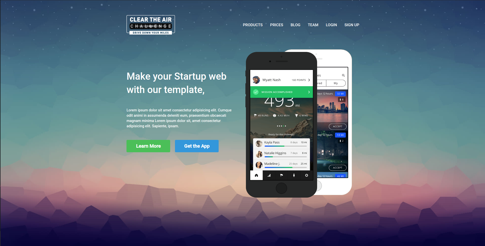

# Responsive Website Design

> A simple design build using CSS/SASS and HTML

## Dekstop Version

### Previous Dekstop

## Mobile Version

### TODO

- [ ]  It would be good a layout only for Tablets.